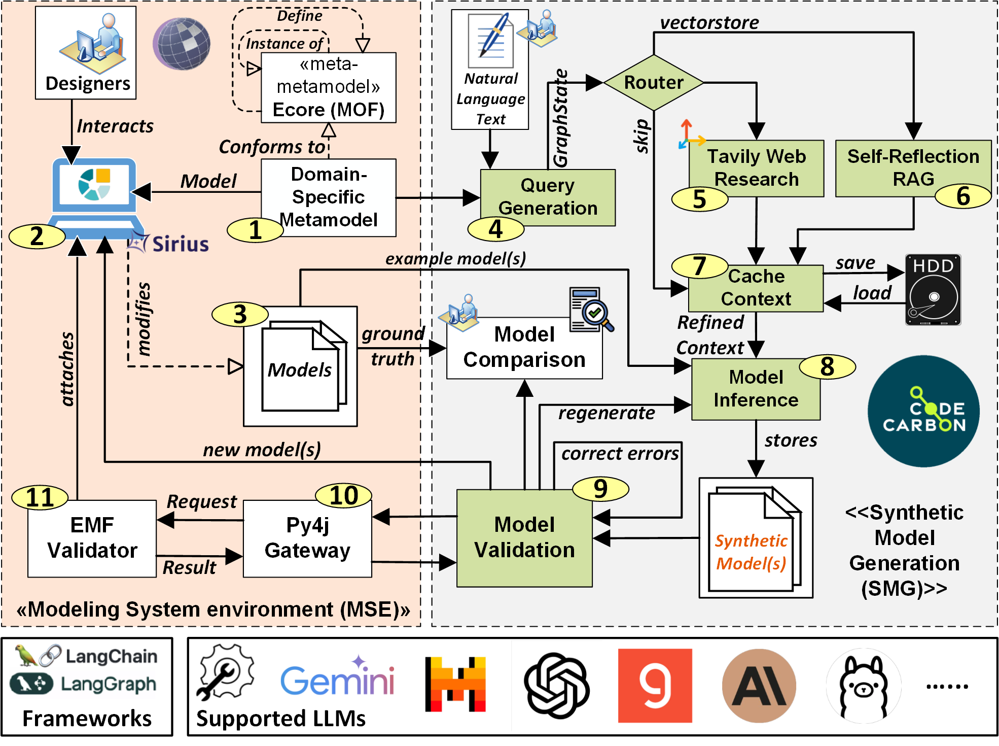

# MuSynGen: A multi-agent LLM-based system for generating synthetic modeling artifacts

A multi-agent LLM-based system for generating synthetic modeling artifacts



**MuSynGen** is a multi-agent framework powered by Large Language Models (LLMs) for the automatic generation of domain-specific models in Model-Driven Engineering (MDE) environments. It has been validated in two application domains: Business Process Model and Notation (BPMN) and Electronic Design Automation (EDA), featuring components for generation, validation, and model analysis.

## 📁 Repository Structure

The repository is organized into three main folders:

### `01_MSE`
Contains the **Modeling System Environment**, including:
- **BPMN Designer**: Eclipse-based graphical modeling workbench built with Sirius for BPMN.
- **HEPSYCODE**: HW/SW co-design tool with EMF-based metamodel for EDA.
- **EMF Validator**: Java-based EMF model validator, integrated via [Py4J](https://www.py4j.org/).

### `02_SMG`
Hosts the **Synthetic Model Generation (SMG)** component, implementing the **MuSynGen** engine:
- Multi-agent orchestration using [LangGraph](https://www.langchain.com/langgraph).
- Retrieval-Augmented Generation (RAG) integration.
- Configurable to run LLMs like GPT-4, Mistral (Small/Large), etc.
- JSON-based configuration for API credentials and agent parameters.

### `03_Model_Comparison`
Includes analysis scripts and results:
- Evaluation metrics for syntactic validity, semantic similarity, and hallucination.
- Experimental data across BPMN and HEPSYCODE domains.
- Visual plots and model comparison results.

## 🚀 Getting Started

1. **Prerequisites**:
   - Python ≥ 3.10
   - Java JDK ≥ 11
   - Eclipse + EMF plugins
   - LLM API Keys (OpenAI, Mistral, etc.)

2. **Open the framework in Jupyter**:
   - Launch JupyterLab or Jupyter Notebook:
     ```bash
     jupyter lab
     ```
   - Navigate to the `02_SMG/D2_Synthetic_Model_Dataset_FS_MAS_RAG_API` folder and open the main notebook (e.g., `HEPSYCODE_musyngen_workflow.ipynb`).
   - Execute each cell step-by-step to run the MuSynGen pipeline.

3. **Validate models using the EMF validator**:
   - Run the provided java application in the `01_MSE/HEPSYCODE/workspace/modelValidation` folder.
   - Ensure Java is properly set up and the Py4J bridge is configured.

## 📊 Evaluation Metrics

- **Syntactic Correctness**: EMF-based model validation.
- **Semantic Correctness**: Levenshtein & Cosine similarity against ground truth.
- **Hallucination**: Analysis of element over/under-generation.
- **Performance**: End-to-end latency and throughput.
- **Sustainability**: Execution Time, Energy, emissions, and cost via [CodeCarbon](https://codecarbon.io/).

## 🧠 Supported LLMs

| Model           | Context Window | Price (Input/Output per 1M tokens) |
|----------------|----------------|------------------------------------|
| GPT-4 Turbo     | 128K           | $10 / $30                          |
| GPT-4o          | 128K           | $2.50 / $10                        |
| Mistral Small   | 131K           | $0.10 / $0.30                      |
| Mistral Large   | 131K           | $2.00 / $6.00                      |

and more...

## 📄 Scientific Reference


## 📬 Contact

- Vittoriano Muttillo — [vmuttillo@unite.it](mailto:vmuttillo@unite.it)  
- Romina Eramo — [reramo@unite.it](mailto:reramo@unite.it)  
- Riccardo Rubei — [riccardo.rubei@univaq.it](mailto:) 
- Claudio Di Sipio — [claudio.disipio@univaq.it](mailto:)
- Giacomo Valente — [giacomo.valente@univaq.it](mailto:)
- Luca Berardinelli — [luca.berardinelli@jku.at](mailto:)

Feel free to reach out for questions, feedback, or collaborations!

## 🛡️ License

This project is licensed under the **GNU General Public License v2.0**.  
See the [`LICENSE`](LICENSE) file for details.
